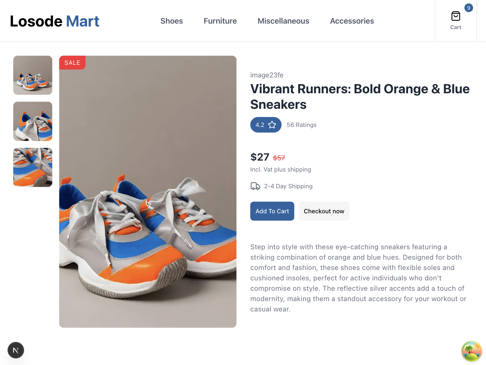

<div align="center">
<h1>LosodeMart Application</h1>
<h6><i>Manage your Client with LosodeMart Application</i></h6>
<hr />
</div>

LosodeMart is a modern ecommerce platform for fashion and lifestyle products, including clothing, shoes, and accessories. Built for scalability and great user experience, it allows customers to seamlessly browse, discover, and purchase quality items from a curated marketplace.

With intuitive navigation, secure payments, and a responsive interface, LosodeMart helps businesses showcase their products while delivering a fast and seamless shopping experience.

# 🏗️ Tech Stack

- **Framework**: [Next.js 16](https://nextjs.org/) with App Router
- **Tailwindcss (Styling)**: [Tailwind CSS 4](https://tailwindcss.com/)
- **React TanStack Query**: [React Tanstack Query](https://tanstack.com/query/latest)
- **Ant Design**: [Ant Design](https://ant.design/) (Ant Design UI)
- **Framer Motion**: [Framer Motion](https://motion.dev/docs)
- **React-Hook Form**: [Redux Hook Form](https://react-hook-form.com)
- **React-Redux**: [Redux Toolkit](https://redux-toolkit.js.org/)
- **Icons**: [Lucide React](https://lucide.dev/)
- **Unit Testing (Jest)** [Unit Testing (Jest)](https://nextjs.org/docs/app/guides/testing/jest)
- **Progressier (PWA-Manifest)** [Progressier)](https://progressier.com/pwa-manifest-generator)
- **@ducanh2912/next-pwa** [ducanh2912 next-pwa](https://ducanh-next-pwa.vercel.app/docs/next-pwa/getting-started)

# 🎯 Prototype



# 🚀 How to Contribute

### 1. Clone the Repository

```bash
git clone https://github.com/geodevcodes/losode.git
cd losode
```

### 2. Install Dependencies

```bash
npm install
```

### 3. Environment Setup

Create a `.env` file in the project root:

```env
# Site Information (Optional)
NODE_ENV="development"
NEXT_PUBLIC_BASEURL="https://fakeapi.platzi.com/en"
NEXT_PUBLIC_APP_URL=https://losode.vercel.app

# Next-Auth Config
NEXTAUTH_URL=https://losode.vercel.app

# Payment
NEXT_PUBLIC_PAYSTACK_PUBLIC_KEY_TEST=pk_test_f83a6f3b151dbfad60871111a1c933d4b9e3c696
NEXT_PUBLIC_PAYSTACK_SECRET_KEY_TEST=sk_test_1437b6b9bf51ab444e755bf435722399f4b037b3

```

### 4. Start Development Server

```bash
npm run dev
```

Visit [http://localhost:3000](http://localhost:3000) to see your application running!

# Deployment

Vercel was used to deploy the app.

- [VERCEL](https://vercel.com/)

# Testing

Unit testing ensure components render correctly and improve application reliability.

📦 Testing Stack

- Jest – Test runner
- React Testing Library – Component testing
- Jest DOM – Extended DOM assertions

```bash
npm run test
```

# License

The MIT License - Copyright (c) 2026 - Present, geodevcodes / Storage Service.

## 🆘 Support

- **Vercel**: [Vercel Documentation](https://vercel.com/)
- **Platzi API**: [Platzi Documentation](https://fakeapi.platzi.com/en)
- **PWA-Manifest Generator**: [PWA Manifest](https://progressier.com/pwa-manifest-generator)

## 🙏 Acknowledgments

- [Next.js](https://nextjs.org) for Frontend
- [Platzi API](https://fakeapi.platzi.com/en) for backend services
- [Tailwind CSS](https://tailwindcss.com)
- [Lucide](https://lucide.dev) for icons

## Built by

- [Rasheed Olatunde](https://github.com/geodevcodes) (Software Developer)
